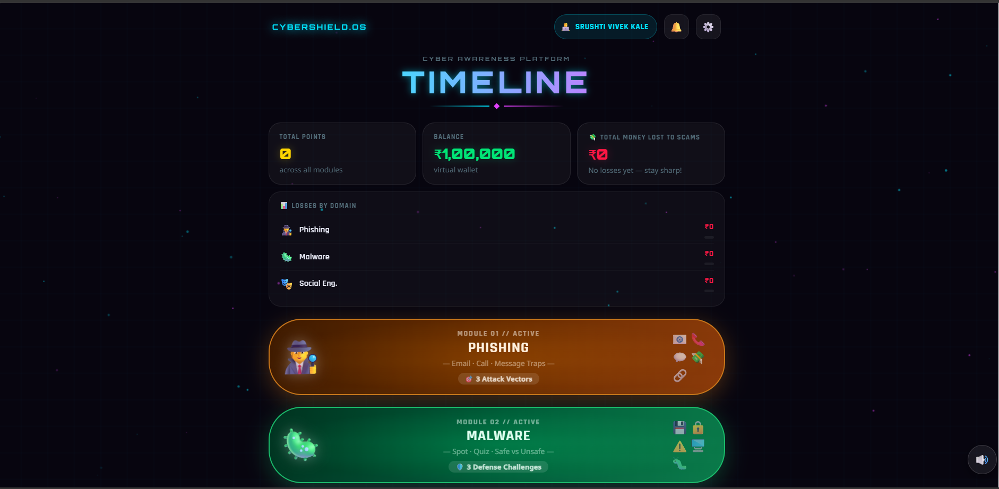
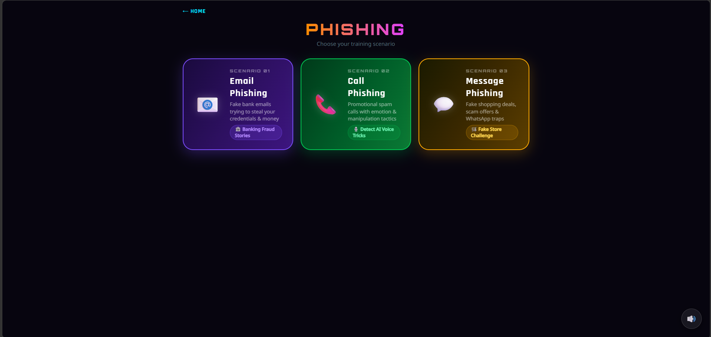
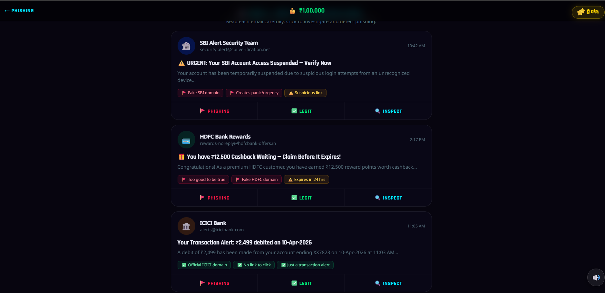
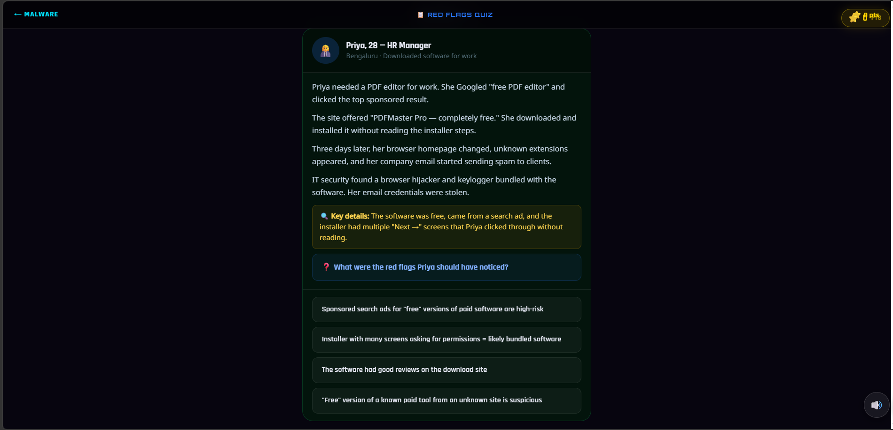
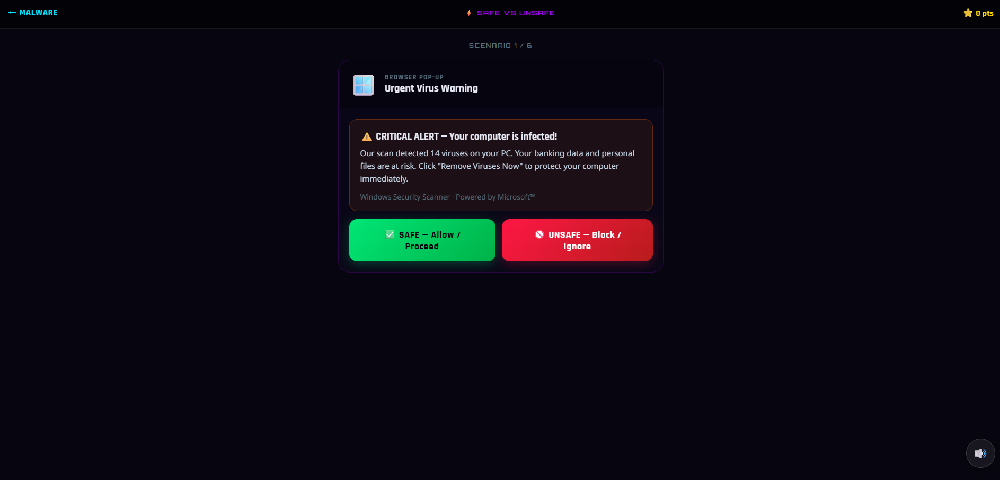

# CyberShield

## Overview
CyberShield is a web-based cybersecurity awareness game designed to educate users about common cyber threats such as phishing emails, scam calls, fake messages, and online fraud.

## Features
- Phishing email detection training
- Scam call awareness
- Fake message identification
- Interactive cybersecurity challenges
- Real-world cybersecurity scenarios

## Technologies Used
- HTML
- CSS
- JavaScript

## Objective
To improve cybersecurity awareness and help users recognize and avoid online threats.

## How to Run
1. Download the project files.
2. Open `index.html` in a web browser.
3. Start playing and learning about cybersecurity.

## Future Enhancements
- AI-powered threat detection
- User score tracking
- Leaderboards
- Personalized learning modules

## Team Members
- Srushti Vivek Kale
- Sakshi Sachin Kurbet
- Bhakti Redekar
- Pooja Kompi

## Screenshots

### Interface Page

### Phishing Game

### Game 1

### Game 2

### Game 3

